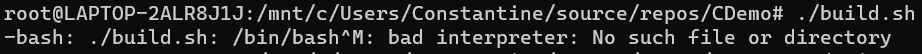

### Особенности операционных систем

Важно обратить внимание при использовании WSL на такие особенности и различия в устройстве операционных систем, как последовательсности символов, означающие перевод строки (`end-line`).

`Windows` исповедует последовательность `CR`&thinsp;`LF`, что означает _возврат каретки \[печатной машинки\]_ (`Carriage Return`, код `13`, `0x0D`) и _подача \[бумаги\] на строку_ (`line feed`, код `10`, `0x0A`) соответственно. Первое возвращает курсор в начало строки, а второе &ndash; добавляет строку (проматывает барабан с бумагой).

`UNIX` для целей перевода строк использует более простую последовательность &ndash; `LF`.


### Почему это важно?
В некоторых случаях различие в последовательностях симолов, означающих перевод строки, может приводить к ошибкам неясной природы. Например:



Что же нам говорит `bash`?
```console
-bash: ./build.sh: /bin/bash^M: bad interpreter: No such file or directory
```
Как будто что-то невразумительное, будто бы `bash` не может найти _файл или папку_ `/bin/bash^M`. И важным моментом здесь является странная приписка `^M`.

Оказывается, что в эмуляторе терминала `^M` означает ввод (или вывод) сочетания клавиш `Ctrl`+`M`. `Ctrl` кодируется символом `^`, а последующая буква, означает саму себя. Если написать простенькую программу, которая считывает символ из потока ввода и возвращает его код, например шестнадцатиричный, то запустив такую программу и подав на вход  последовательность `^M` (а попросту зажав `Ctrl` и `M`), можно получить в качестве ответа `0x0A`, что тоже самое, что `10` в шестнадцатеричной системе.

#### Простенькая программа
```c
#include <stdlib.h>
#include <stdio.h>
#include <errno.h>

int main()
{
	char code;
	int result = scanf("%c", &code);
	if (result != 1)
	{
        errno = EIO;
        perror("code reading failed");
		return EXIT_FAILURE;
	}
	
	printf("code is '0x%.2X'\n", code);
    return EXIT_SUCCESS;
}
```